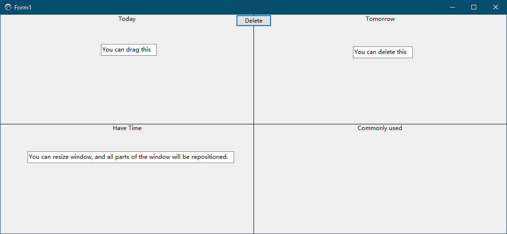

# A Program about Todo
This is a self-use program about todo. It is written in Lazarus(delphi-like).

## Usage
- Double-click on the window to create a text box at the position of the mouse, then fill in what to do.   
- There are 4 areas in the window: Today, Tomorrow, Have Time, Commonly used. You can drag todo to any place.
- You can select todo and click Delete to delete it.
- The todos will be stored in the database when the program exits.
- You can resize window, and all parts of the window will be repositioned.
